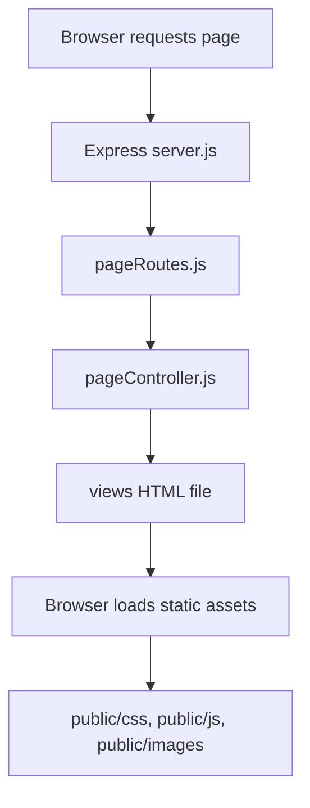
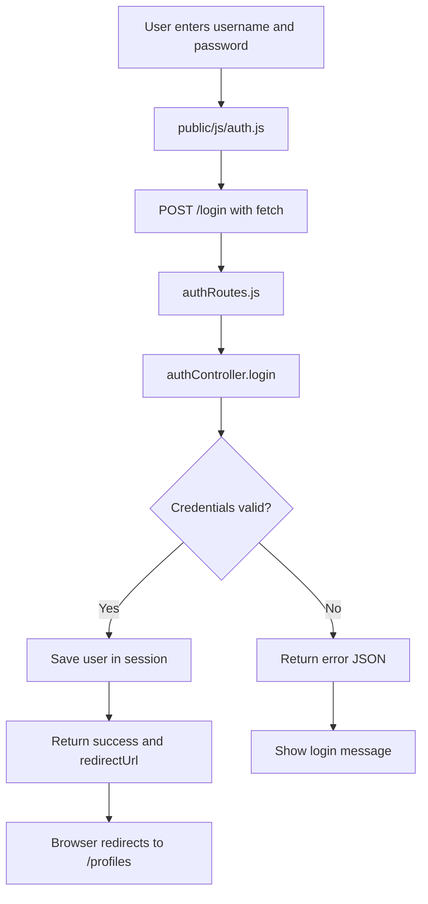
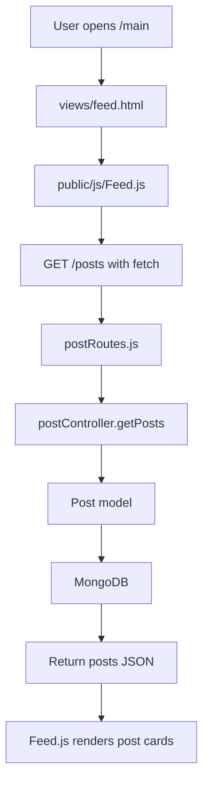
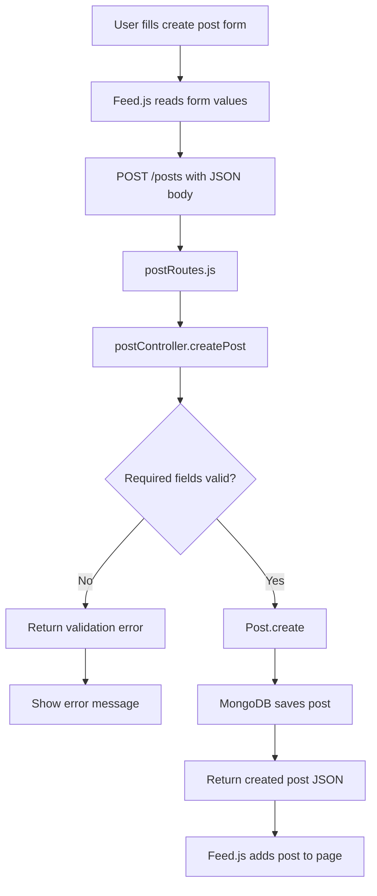
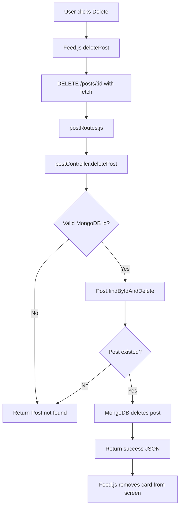
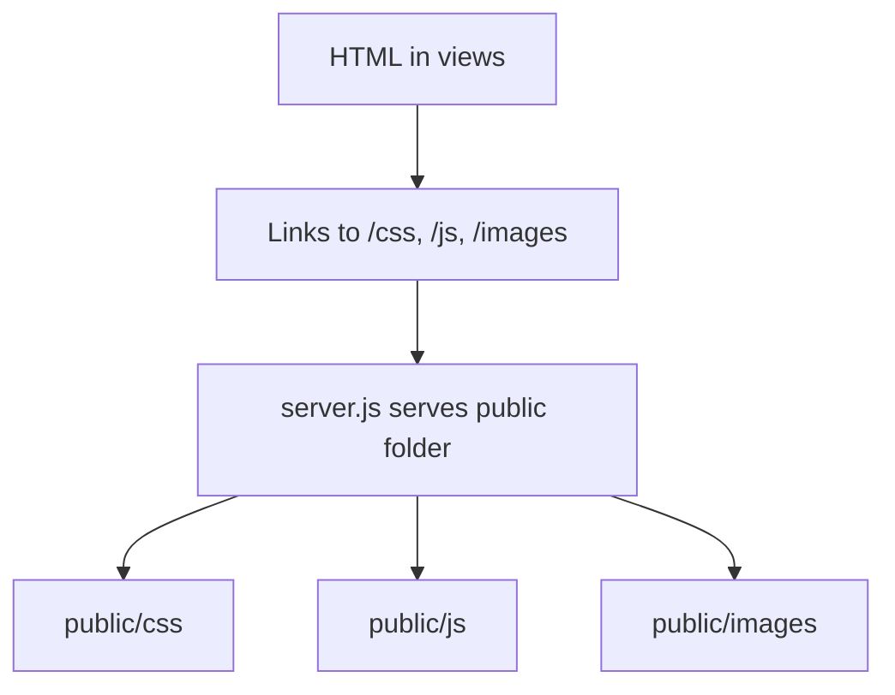

# Assignment 4 Flow Charts

This document describes the main request flows in the SpongeNchill Assignment 4 project.

## MVC Page Flow

## Login Flow

## Load Posts Flow

## Create Post Flow

## Delete Post Flow

## Static Assets Flow

